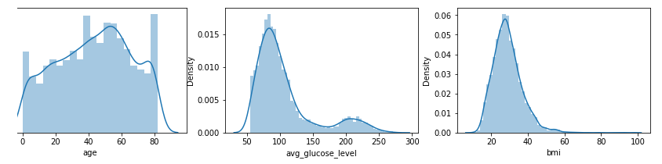
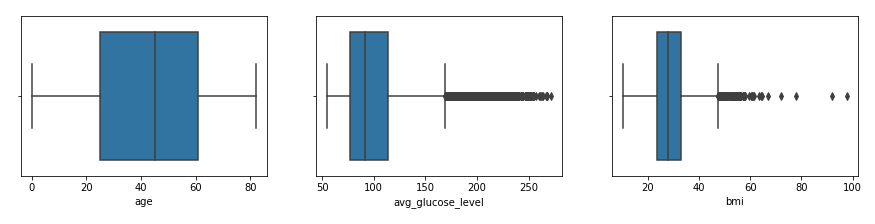
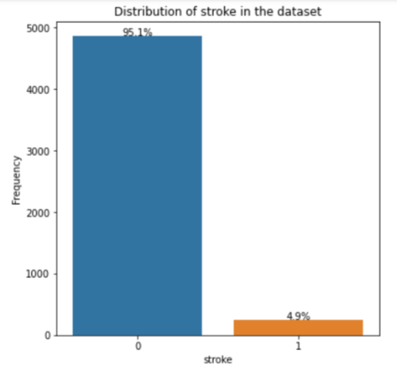

**Patient Heart Stroke Prediction**

***Dataset source :*** https://www.kaggle.com/fedesoriano/stroke-prediction-dataset

***Problem Statement:***

According to the WHO, stroke is the 2nd leading cause of death globally.
Stroke is responsible for approximately 11% of total deaths in the world.
The dataset is provided to predict whether a patient is likely to get stroke or not on the basis of given input parameters :
Input parameters : (gender, age, hypertension, heart_disease, ever_married, work_type, Residence_type, Average_glucose_level,bmi and smoking_status)
The target variable is to predict whether the patient is likely to get storke or not.
Surfacely, it looks like a binary classification problem.

 
 
***Insights From Exploratory Data Analysis***

<li>Age and target variable weak positive relationship (almost .25).</li>

<li>Average glucose level's mean scores on the target have differences between a person who has a stroke or not. But these differences are small.</li>

<li>BMI does not have any significant relationship with the target variable.</li>

<li>A person with hypertension is almost 3.3 times more likely to get a stroke than the ones who don't have hypertension.</li>

<li>Male compared to female are more likely to get strokes, but the difference between female and male is very small.</li>

<li>A person with heart disease is 4.07 times more likely to get a stroke than the ones who don't have heart disease.</li>

<li>A person who is married(or married before) is 5.7 times more likely to get a stroke than the ones who don't have a marriage history.</li>

<li>Self employed person has more probability to get strokes than other work types.</li>

<li>Person who lives in a rural area slightly has a higher probability of getting a stroke than a person who lives in a rural area. Difference is small.
There is a small difference between who smokes and who does not smoke in regard to the probability of getting a stroke.</li>

 

***Data Distribution***
 

 

***Outlier Detection***
 

 

  
***Insights from Target Variable***

<li>Almost %95 of the instances of our target variable is 'No stroke'</li>

<li>4861 patients do not have a stroke.</li>

<li>%5 of the instances of our target variable is 'Stroke'.</li>

<li>249 patients have a stroke.</li>

<li>We have imbalanced data.</li>

<li>Our stroke dataset is an example of a so-called imbalanced dataset.</li>

<li>There are 19 times more people who didn’t have strokes in our data than who had, and we say that the non-stroke class dominates the stroke class.
We can clearly see that: the stroke rate in our data is 0.048 Which is a strong indicator of class imbalance.</li>

 
  

 
 
***Imbalance Datasets***

<li>Instances across classes are imbalanced, like in our dataset, we have imbalance data.</li>

<li>The problem is, most of the machine learning algorithms do not work well with the imbalanced data.</li>

<li>Some of the metrics (like accuracy) give us misleading results.</li>

<li>Most of the time in classification problems our interest is to get better predictions on the minority class.</li>

<li>In our example: People who had a stroke are in the minority class.</li>

<li>Otherwise our machine learning algorithm falsely predicts the majority class.
In our example: No stroke is the majority class.</li>

 
 
 
***Decide the metric***

<li>This is the first step when approaching a machine learning problem: decide the metric!</li>

<li>The choice of the wrong metric can mean choosing the wrong algorithm.</li>

<li>We see that the target is skewed and thus the best metric for this binary classification problem would be Area Under the ROC Curve (AUC).</li>

<li>We can use precision and recall too, but AUC combines these two metrics.</li>

<li>We have already seen the label/target distribution, and we know that it is a binary classification problem with skewed targets.</li>

<li>Just for further info, it is not advisable to use accuracy as an evaluation metric, when dealing with highly imbalanced data.</li>
 
 
***Model Performance***

<li>On our baseline model, every model gets an roc score of 50 to 52% since 95% of data belong to one class and all models fail to predict the lower minority class.</li> 

<li>We have used an oversampling technique to balance the classes of each instance of our target variable to solve class imbalance problems.</li>

<li>Then, we were able to get around 75% auc roc score or 22% F1 score. Recall is around 80% but precision of the model was still low.</li>
 

***Conclusion***

<li><b>On our first hypothesis, we have thought bmi would be a good indicator or measure in predicting the likelihood of getting a stroke.</b?</li>

<li><b>But, according to the data, there are many outliers in the bmi column and found as a weak feature for our target which is against the medical use case.</b></li>

<li><b>Accuracy metric is not a good metric to choose for imbalance datasets.</b></li>

<li><b>F1 score and Roc-Auc score is a reliable metric for class imbalance problem like ours</b></li>

<li><b>Oversampling techniques like Smote are really good tools to use incase of class imbalance problems.</b></li>

<li><b>Logistic Regression model and SVM model are the top performing models with ROC-AUC score of around 77% and a F1 score of around 0.23.</b></li>

<li><b>More features can be added to the dataset such as the patient's exercise pattern, blood pressure and so on.</b></li>

<li><b>This model is best suited for  the prognosis of stroke prediction.</b></li>

<li><b>Since it has high recall and low precision, early signs or predictions of  getting a stroke can be useful for the patient to take care of their health problems even more seriously.</b></li>
